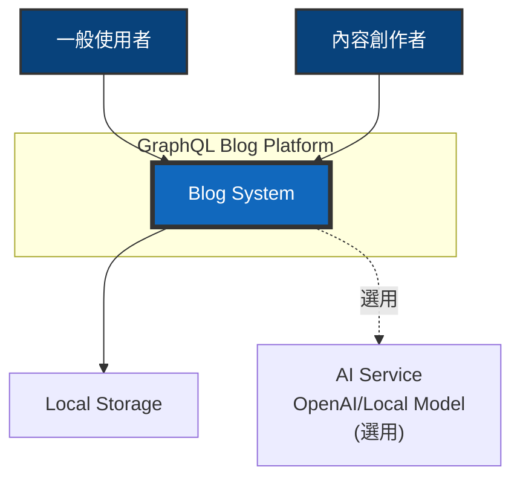
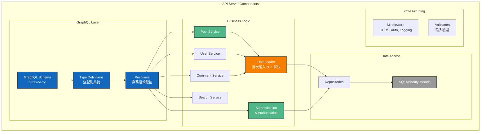
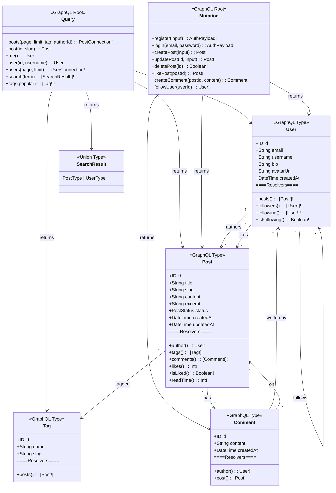
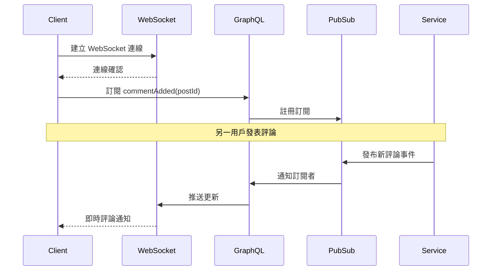
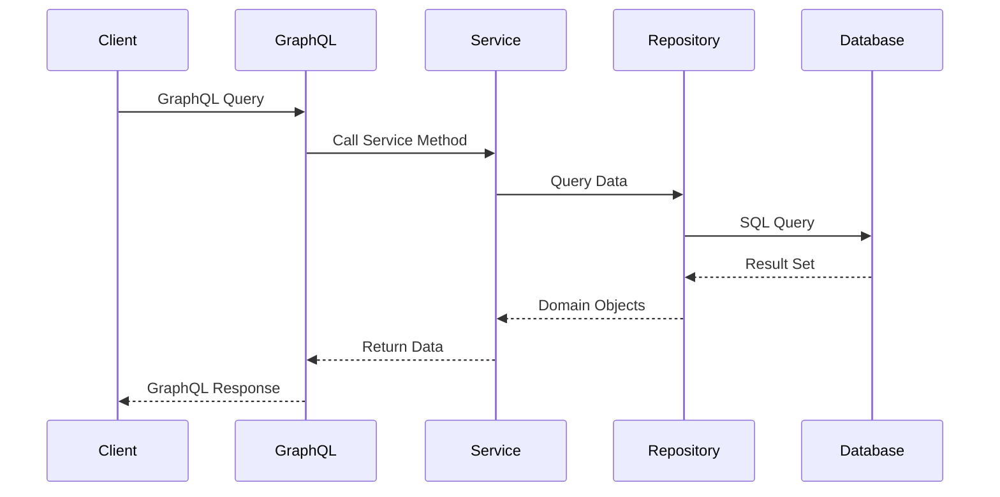
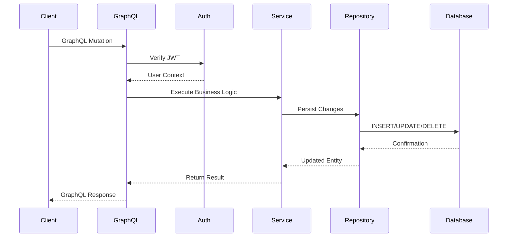
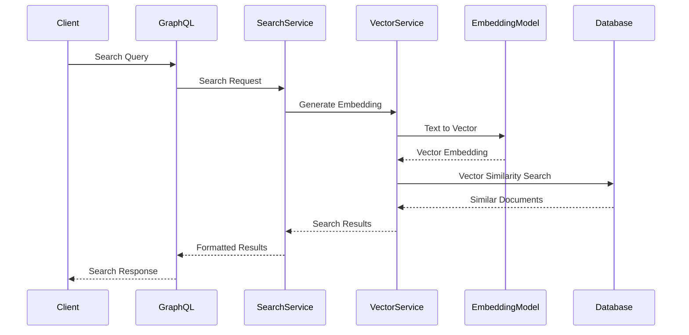

# GraphQL 部落格平台 - 系統架構文件

## 目錄

- [架構概述](#架構概述)
- [C4 模型架構圖](#c4-模型架構圖)
  - [Level 1: System Context](#level-1-system-context)
  - [Level 2: Container Diagram](#level-2-container-diagram)
  - [Level 3: Component Diagram](#level-3-component-diagram)
  - [Level 4: Code Diagram](#level-4-code-diagram)
- [技術決策](#技術決策)
- [資料流程](#資料流程)
- [安全架構](#安全架構)
- [效能考量](#效能考量)

## 架構概述

本系統採用現代化的前後端分離架構，以 GraphQL 作為 API 層，實現高效的資料查詢與變更。

後端使用 Python 3.13 搭配 FastAPI 框架，前端使用 SvelteKit 與 Svelte 5，資料庫採用 PostgreSQL 搭配 pgvector 擴充套件支援向量搜尋。

### 技術元件分類

#### 核心元件（必需）
- **PostgreSQL 16** - 主要資料庫
- **FastAPI** - Web 框架
- **Strawberry** - GraphQL 函式庫
- **SQLAlchemy 2.0** - ORM

#### 選用元件（增強功能）
- **pgvector** - 向量搜尋（進階 AI 功能）

### 核心原則

1. **關注點分離**: 清晰的層次架構，各層職責明確
2. **可測試性**: 採用 TDD 開發，確保程式碼品質（詳見 [TDD 指南](./tdd-guide.md)）
3. **可擴展性**: 模組化設計，易於新增功能
4. **效能優先**: 使用異步處理、快取策略、查詢優化

## C4 模型架構圖

### Level 1: System Context

系統整體環境圖，展示系統與外部使用者及系統的互動關係。



> **註：** 「一般使用者」和「內容創作者」代表不同的使用情境。實際系統中，任何註冊用戶都可以扮演這兩種角色 - 既可以閱讀他人內容（一般使用者），也可以發表自己的文章（內容創作者）。未註冊的訪客僅能瀏覽和搜尋公開內容。

### Level 2: Container Diagram

容器層級圖，展示主要的技術組件及其互動方式。


### Level 3: Component Diagram

組件層級圖，展示後端 API Server 的內部結構。



> **GraphQL 架構優勢：**
> - **單一端點**：所有 API 操作通過 `/graphql` 端點，簡化客戶端整合
> - **精確查詢**：客戶端指定所需欄位，避免過度獲取（Over-fetching）或不足獲取（Under-fetching）
> - **DataLoader Pattern**：批次載入相關資料，有效解決 N+1 查詢問題
> - **強型別系統**：Schema 定義提供自動驗證、自動文件生成、IDE 智能提示
> - **統一介面**：Query（查詢）、Mutation（變更）、Subscription（訂閱）使用一致的 Schema 定義
> - **版本控制**：Schema 演進而非版本化，透過 @deprecated 標記漸進式更新

### Level 4: GraphQL Schema Diagram

GraphQL Type 系統圖，展示 Schema 定義與關係解析。



> **GraphQL Schema 特色：**
> - **Type System**：強型別定義，提供自動驗證和文件
> - **Resolver Pattern**：每個欄位都可以有獨立的解析邏輯
> - **計算欄位**：如 `isLiked`、`readTime` 等動態計算
> - **關係導航**：客戶端可自由組合查詢關聯資料
> - **單一入口**：所有操作通過 Query/Mutation/Subscription
> - **Union Types**：支援多型返回值，如搜尋結果可同時返回文章和用戶（[詳細說明](./union-types-guide.md)）

### Subscription 即時通訊架構

GraphQL Subscription 透過 WebSocket 提供即時雙向通訊能力：



**實作的 Subscription 功能：**
- `commentAdded(postId: ID!)` - 文章新評論即時通知
- `userStatusChanged(userId: ID!)` - 用戶上線/離線狀態追蹤

## 技術決策

### 為什麼選擇 GraphQL？

1. **精確的資料獲取**: 客戶端可以準確指定需要的資料
2. **減少請求次數**: 一次請求獲取多個資源
3. **強型別**: Schema 提供清晰的 API 契約
4. **自文件化**: Schema 即文件

### 為什麼選擇 FastAPI + Strawberry？

#### Strawberry 的核心優勢

1. **Python Type Hints 原生整合**
   - 使用 Python 的型別註解自動生成 GraphQL Schema
   - 編譯時期型別檢查，減少執行時錯誤
   - 程式碼即文檔，維護更簡單
   ```python
   @strawberry.type
   class UserType:
       id: strawberry.ID
       username: str
       email: Optional[str] = None  # 自動轉換為 GraphQL nullable 欄位
   ```

2. **現代化的裝飾器語法**
   - 比 Graphene 更簡潔、更 Pythonic
   - 減少樣板程式碼
   - 直觀的 API 設計
   ```python
   @strawberry.field
   async def get_posts(self, info: Info) -> List[PostType]:
       # 非同步查詢，自動處理
       return await PostService.get_all()
   ```

3. **與 FastAPI 完美整合**
   - 共享相同的依賴注入系統
   - 統一的異步處理模型
   - 整合的錯誤處理機制
   - 單一應用程式，同時支援 REST 和 GraphQL

4. **內建權限控制系統**
   - 使用 `permission_classes` 實現細粒度權限控制
   - 支援欄位級別的權限設定
   - 與 FastAPI 的認證系統無縫整合
   ```python
   @strawberry.field(permission_classes=[IsAuthenticated])
   async def protected_data(self) -> str:
       return "只有認證用戶可見"
   ```

5. **優秀的開發者體驗**
   - 自動生成 GraphiQL 測試介面
   - 詳細的錯誤訊息和堆疊追蹤
   - 支援熱重載
   - 完整的 VS Code 智能提示支援

#### 與其他 Python GraphQL 框架比較

| 特性 | Strawberry | Graphene | Ariadne |
|------|------------|----------|---------|
| Type Hints | ✅ 原生支援 | ⚠️ 部分支援 | ❌ 字串 Schema |
| 異步支援 | ✅ 原生 async/await | ⚠️ 需要額外配置 | ✅ 支援 |
| 學習曲線 | 低（Pythonic） | 中等 | 高（Schema First） |
| FastAPI 整合 | ✅ 官方支援 | ⚠️ 第三方套件 | ⚠️ 需要自行整合 |
| 程式碼生成 | ✅ 自動 | ⚠️ 較多樣板 | ❌ 手動定義 |
| 社群活躍度 | ✅ 快速成長 | ✅ 成熟穩定 | ⚠️ 相對較小 |

#### 實際效益

1. **開發速度提升**：減少樣板程式碼，專注業務邏輯
2. **更少的錯誤**：型別安全在編譯時期捕捉錯誤
3. **維護成本降低**：程式碼即文檔，自動同步更新
4. **效能優異**：原生異步支援，適合高並發場景

### 為什麼選擇 PostgreSQL + pgvector？

1. **關聯式資料**: 部落格資料本質上是關聯式的
2. **ACID 特性**: 確保資料一致性
3. **向量搜尋**: pgvector 支援語義搜尋
4. **成熟穩定**: PostgreSQL 是最可靠的開源資料庫

### 為什麼選擇 SvelteKit + Svelte 5？

1. **編譯時優化**: 無虛擬 DOM，效能更好
2. **簡潔語法**: 更少的樣板代碼
3. **Runes 系統**: Svelte 5 的響應式更強大
4. **內建功能**: 路由、SSR 等功能內建

## 資料流程

### 查詢流程 (Query)



### 變更流程 (Mutation)



### 向量搜尋流程 (選用功能)

> 此功能需要 pgvector 擴充套件，為選用的進階功能



## GraphQL 安全特性

### GraphQL 內建安全優勢

1. **Schema 層級驗證**
   - 強型別系統自動驗證所有輸入
   - 無效查詢在執行前就被拒絕
   - 降低注入攻擊風險

2. **查詢控制機制**
   - **深度限制**：防止過度嵌套的查詢（如 `user.posts.comments.author.posts...`）
   - **複雜度限制**：根據欄位權重計算查詢成本
   - **速率限制**：基於查詢複雜度而非請求數量

3. **細粒度權限控制**
   - Field-level 授權：每個欄位可有獨立權限
   - Resolver 層級驗證：業務邏輯層的安全檢查
   - Context-based 權限：基於使用者身份動態控制
   - PermissionExtension：Strawberry 權限控制實現（[詳細實作指南](./permissions-guide.md)）

4. **防護最佳實踐**
   ```python
   # 查詢深度限制範例
   from strawberry.extensions import QueryDepthLimiter

   schema = strawberry.Schema(
       query=Query,
       extensions=[QueryDepthLimiter(max_depth=5)]
   )

   # Field 權限範例
   @strawberry.field
   def sensitive_data(self, info) -> str:
       if not info.context.user.is_authenticated:
           raise PermissionError("需要登入")
       return self._sensitive_data
   ```

## 效能考量

### 查詢優化策略

1. **DataLoader Pattern**
   - 解決 N+1 查詢問題
   - 批次載入關聯資料
   - 詳細實作請參考 [DataLoader 實作文檔](./dataloader-implementation.md)

2. **GraphQL 進階特性**
   - [Union Types 指南](./union-types-guide.md) - 多型查詢返回
   - [Fragment 指南](./fragment-guide.md) - 查詢片段重用
   - [權限控制指南](./permissions-guide.md) - GraphQL 權限控制機制
   - **Subscription 即時通訊** - WebSocket 整合實現評論即時更新、用戶狀態追蹤

3. **資料庫索引**

```sql
-- 常用查詢索引
CREATE INDEX idx_posts_author_id ON posts(author_id);
CREATE INDEX idx_posts_created_at ON posts(created_at DESC);
CREATE INDEX idx_posts_status ON posts(status) WHERE status = 'published';

-- 全文搜尋索引
CREATE INDEX idx_posts_search ON posts USING gin(to_tsvector('english', title || ' ' || content));

-- 向量搜尋索引
CREATE INDEX idx_posts_embedding ON posts USING ivfflat (embedding vector_cosine_ops);
```

4. **快取策略（選用）**
   - 應用層快取（Python 內建快取）
   - 瀏覽器快取

### 異步處理

1. **異步 I/O**
   - FastAPI 異步端點
   - SQLAlchemy 異步 Session

2. **異步操作**
   - 向量生成（使用異步函式）
   - 圖片處理（使用異步函式）

### 基本監控（教學用）

- **開發階段監控**
  - FastAPI 自動文件 (`/docs`)
  - GraphQL Playground (`/graphql`)
  - 基本錯誤日誌
