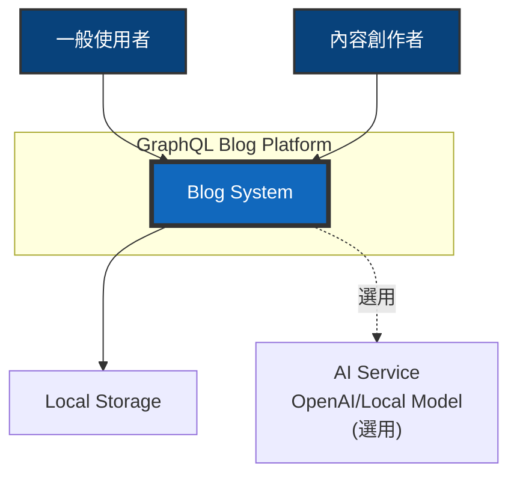
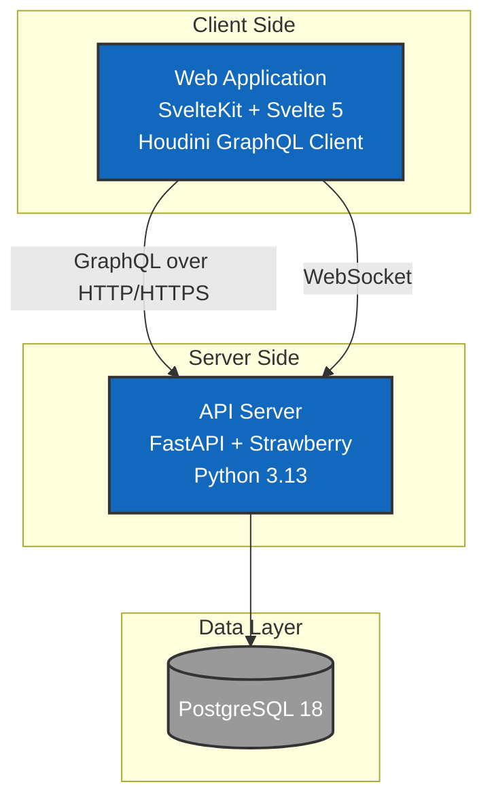
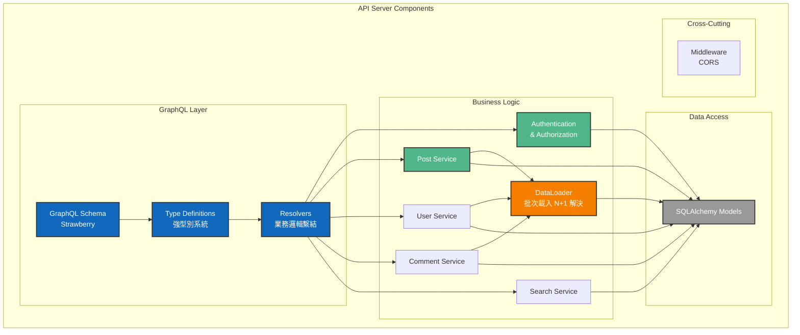
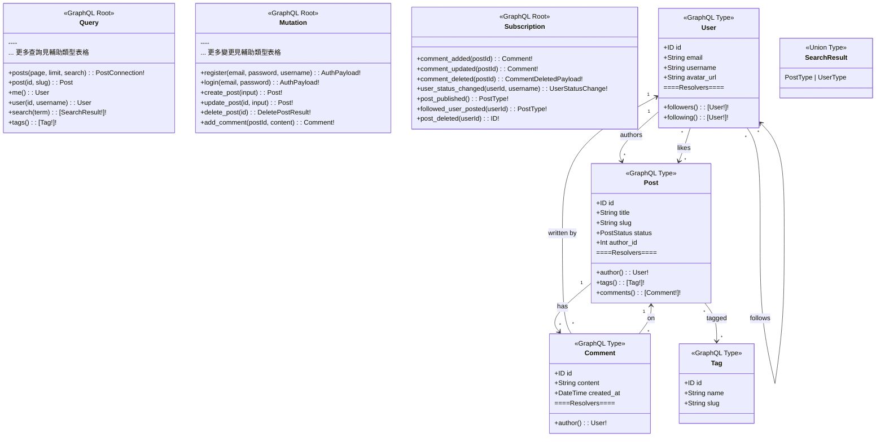
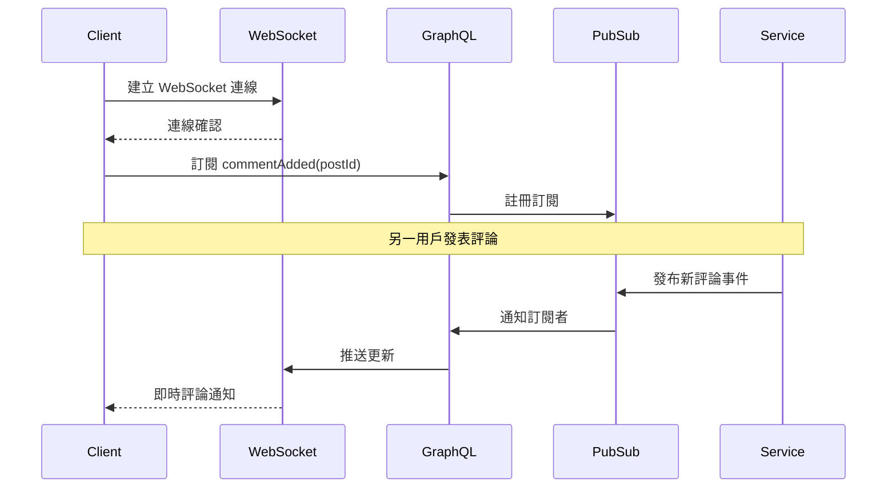
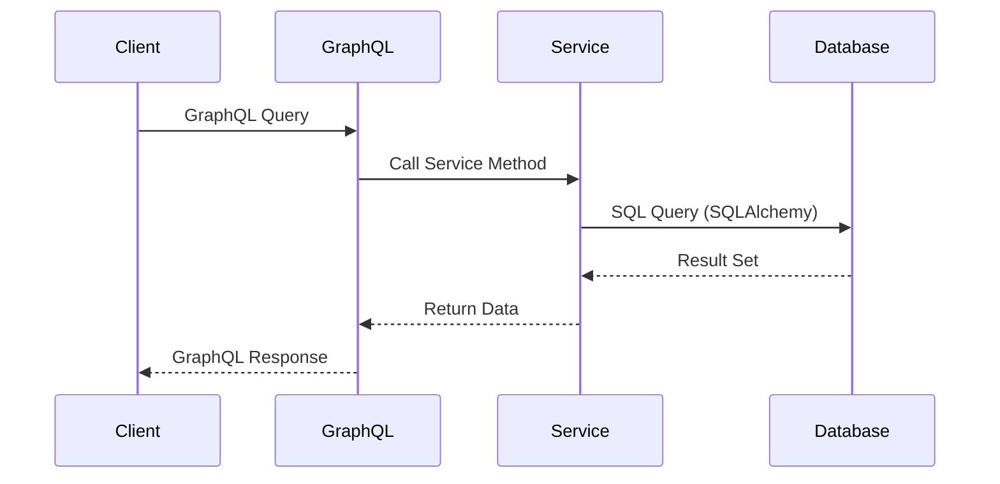
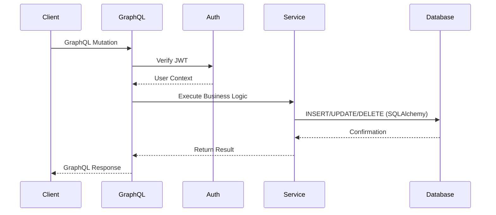

# GraphQL 部落格平台 - 系統架構文件

## 目錄

- [架構概述](#架構概述)
- [C4 模型架構圖](#c4-模型架構圖)
  - [Level 1: System Context](#level-1-system-context)
  - [Level 2: Container Diagram](#level-2-container-diagram)
  - [Level 3: Component Diagram](#level-3-component-diagram)
  - [Level 4: Code Diagram](#level-4-code-diagram)
- [技術決策](#技術決策)
- [資料流程](#資料流程)
- [安全架構](#安全架構)
- [效能考量](#效能考量)

## 架構概述

本系統採用現代化的前後端分離架構，以 GraphQL 作為 API 層，實現高效的資料查詢與變更。

後端使用 Python 3.13 搭配 FastAPI 框架，前端使用 SvelteKit 與 Svelte 5，資料庫採用 PostgreSQL。

### 技術元件分類

#### 核心元件（必需）
- **PostgreSQL 18** - 主要資料庫
- **FastAPI** - Web 框架
- **Strawberry** - GraphQL 函式庫
- **SQLAlchemy 2.0** - ORM

#### 選用元件（未來擴充）
- **pgvector** - 向量搜尋（尚未實作）

### 核心原則

1. **關注點分離**: 清晰的層次架構，各層職責明確
2. **可測試性**: 採用 TDD 開發，確保程式碼品質（詳見 [TDD 指南](./tdd-guide.md)）
3. **可擴展性**: 模組化設計，易於新增功能
4. **效能優先**: 使用異步處理、快取策略、查詢優化

## C4 模型架構圖

### Level 1: System Context

系統整體環境圖，展示系統與外部使用者及系統的互動關係。



> **註：** 「一般使用者」和「內容創作者」代表不同的使用情境。實際系統中，任何註冊用戶都可以扮演這兩種角色 - 既可以閱讀他人內容（一般使用者），也可以發表自己的文章（內容創作者）。未註冊的訪客僅能瀏覽和搜尋公開內容。

### Level 2: Container Diagram

容器層級圖，展示主要的技術組件及其互動方式。



### Level 3: Component Diagram

組件層級圖，展示後端 API Server 的內部結構。



> **GraphQL 架構優勢：**
> - **單一端點**：所有 API 操作通過 `/graphql` 端點，簡化客戶端整合
> - **精確查詢**：客戶端指定所需欄位，避免過度獲取（Over-fetching）或不足獲取（Under-fetching）
> - **DataLoader Pattern**：批次載入相關資料，有效解決 N+1 查詢問題
> - **強型別系統**：Schema 定義提供自動驗證、自動文件生成、IDE 智能提示
> - **統一介面**：Query（查詢）、Mutation（變更）、Subscription（訂閱）使用一致的 Schema 定義
> - **版本控制**：Schema 演進而非版本化，透過 @deprecated 標記漸進式更新

### Level 4: GraphQL Schema Diagram

GraphQL Type 系統圖，展示 Schema 定義與關係解析。



> **關係符號說明：**
> - `"1" --> "*"` 一對多（如：一個 User 可以寫多篇 Post）
> - `"*" --> "*"` 多對多（如：多個 User 可以追蹤多個 User）
> - 自我關聯（如 `User --> User`）表示同一實體間的關係

> **關係解讀：**
>
> | 關係 | 解讀 |
> |------|------|
> | `User "1" --> "*" Post : authors` | 一個 User 可以寫多篇 Post |
> | `User "*" --> "*" User : follows` | 多個 User 可以追蹤多個 User（多對多） |
> | `User "*" --> "*" Post : likes` | 多個 User 可以喜歡多篇 Post（多對多） |
> | `Post "1" --> "*" Comment : has` | 一篇 Post 可以有多個 Comment |
> | `Post "*" --> "*" Tag : tagged` | 多篇 Post 可以有多個 Tag（多對多） |
> | `Comment "*" --> "1" User : written by` | 多個 Comment 由一個 User 寫 |
> | `Comment "*" --> "1" Post : on` | 多個 Comment 在一篇 Post 上 |

> **GraphQL Schema 特色：**
> - **Type System**：強型別定義，提供自動驗證和文件
> - **Resolver Pattern**：每個欄位都可以有獨立的解析邏輯
> - **計算欄位**：如 `is_liked`、`likes_count`、`total_comments` 等動態計算
> - **關係導航**：客戶端可自由組合查詢關聯資料
> - **單一入口**：所有操作通過 Query/Mutation/Subscription
> - **Union Types**：支援多型返回值，如搜尋結果可同時返回文章和用戶（[詳細說明](./union-types-guide.md)）

> **命名約定：** Python 欄位使用 snake_case（如 `avatar_url`），GraphQL Schema 自動轉換為 camelCase（如 `avatarUrl`）。

#### 輔助類型參考

##### Enum Types

| Enum | 值 | 說明 |
|------|----|------|
| PostStatus | DRAFT, PUBLISHED, ARCHIVED | 文章狀態 |
| UserStatus | ONLINE, OFFLINE | 用戶在線狀態 |

##### Input Types

| Input Type | 用於 | 欄位 |
|------------|------|------|
| PostInput | create_post | title, content, excerpt?, slug?, status?, tags? |
| UpdatePostInput | update_post | title?, content?, excerpt?, slug?, status?, tags? |
| UpdateUserInput | update_me | username?, full_name?, bio?, avatar_url? |
| CommentInput | （已定義但未使用） | content |
| UpdateCommentInput | update_comment | content |

##### Response Types

| Response Type | 用於 | 欄位 |
|---------------|------|------|
| AuthPayload | register, login | user, token |
| PostConnection | posts 分頁查詢 | edges, page_info |
| DeletePostResult | delete_post | success, message |
| LikeMutationResponse | like_post, unlike_post | success, message, post? |
| CommentMutationResponse | update_comment, delete_comment | success, message?, comment? |
| FollowResponse | follow_user | success, message, follow? |
| UnfollowResponse | unfollow_user | success, message |

##### Subscription Types

| Type | 欄位 | 說明 |
|------|------|------|
| UserStatusChange | user_id, username, status, timestamp | 用戶狀態變更事件 |
| OnlineUserInfo | user_id, username | 在線用戶資訊 |

### Subscription 即時通訊架構

> 詳細實作請參考 [Subscription 即時通訊指南](./subscription-guide.md)

GraphQL Subscription 透過 WebSocket 提供即時雙向通訊能力：



**實作的 Subscription 功能：**

- `commentAdded(postId: ID!)` - 文章新評論即時通知
- `userStatusChanged(userId: ID!, username: String!)` - 用戶上線/離線狀態追蹤
- `postPublished` - 新文章發布事件（前端用於列表「有新文章」提示條，不彈通知）
- `followedUserPosted(userId: ID!)` - 追蹤用戶發文通知（需傳入當前用戶 ID）
- `postDeleted(userId: ID!)` - 文章刪除即時更新（需傳入當前用戶 ID）

## 技術決策

### 為什麼選擇 GraphQL？

1. **精確的資料獲取**: 客戶端可以準確指定需要的資料
2. **減少請求次數**: 一次請求獲取多個資源
3. **強型別**: Schema 提供清晰的 API 契約
4. **自文件化**: Schema 即文件

### 為什麼選擇 FastAPI + Strawberry？

#### Strawberry 的核心優勢

1. **Python Type Hints 原生整合**
   - 使用 Python 的型別註解自動生成 GraphQL Schema
   - 編譯時期型別檢查，減少執行時錯誤
   - 程式碼即文檔，維護更簡單
   ```python
   @strawberry.type
   class UserType:
       id: strawberry.ID
       username: str
       email: Optional[str] = None  # 自動轉換為 GraphQL nullable 欄位
   ```

2. **現代化的裝飾器語法**
   - 比 Graphene 更簡潔、更 Pythonic
   - 減少樣板程式碼
   - 直觀的 API 設計
   ```python
   @strawberry.field
   async def get_posts(self, info: Info) -> List[PostType]:
       # 非同步查詢，自動處理
       return await PostService.get_all()
   ```

3. **與 FastAPI 完美整合**
   - 共享相同的依賴注入系統
   - 統一的異步處理模型
   - 整合的錯誤處理機制
   - 單一應用程式，同時支援 REST 和 GraphQL

4. **內建權限控制系統**
   - 使用 `permission_classes` 實現細粒度權限控制
   - 支援欄位級別的權限設定
   - 與 FastAPI 的認證系統無縫整合
   ```python
   @strawberry.field(permission_classes=[IsAuthenticated])
   async def protected_data(self) -> str:
       return "只有認證用戶可見"
   ```

5. **優秀的開發者體驗**
   - 自動生成 GraphiQL 測試介面
   - 詳細的錯誤訊息和堆疊追蹤
   - 支援熱重載
   - 完整的 VS Code 智能提示支援

#### 與其他 Python GraphQL 框架比較

| 特性 | Strawberry | Graphene | Ariadne |
|------|------------|----------|---------|
| Type Hints | ✅ 原生支援 | ⚠️ 部分支援 | ❌ 字串 Schema |
| 異步支援 | ✅ 原生 async/await | ⚠️ 需要額外配置 | ✅ 支援 |
| 學習曲線 | 低（Pythonic） | 中等 | 高（Schema First） |
| FastAPI 整合 | ✅ 官方支援 | ⚠️ 第三方套件 | ⚠️ 需要自行整合 |
| 程式碼生成 | ✅ 自動 | ⚠️ 較多樣板 | ❌ 手動定義 |
| 社群活躍度 | ✅ 快速成長 | ✅ 成熟穩定 | ⚠️ 相對較小 |

#### 實際效益

1. **開發速度提升**：減少樣板程式碼，專注業務邏輯
2. **更少的錯誤**：型別安全在編譯時期捕捉錯誤
3. **維護成本降低**：程式碼即文檔，自動同步更新
4. **效能優異**：原生異步支援，適合高並發場景

### 為什麼選擇 PostgreSQL？

1. **關聯式資料**: 部落格資料本質上是關聯式的
2. **ACID 特性**: 確保資料一致性
3. **全文搜尋**: 內建全文搜尋功能
4. **成熟穩定**: PostgreSQL 是最可靠的開源資料庫
5. **擴展性**: 未來可透過 pgvector 擴充支援向量搜尋

### 為什麼選擇 SvelteKit + Svelte 5？

1. **編譯時優化**: 無虛擬 DOM，效能更好
2. **簡潔語法**: 更少的樣板代碼
3. **Runes 系統**: Svelte 5 的響應式更強大
4. **內建功能**: 路由、SSR 等功能內建

## 資料流程

### 查詢流程 (Query)



### 變更流程 (Mutation)



## GraphQL 安全特性

### GraphQL 內建安全優勢

1. **Schema 層級驗證**
   - 強型別系統自動驗證所有輸入
   - 無效查詢在執行前就被拒絕
   - 降低注入攻擊風險

2. **查詢控制機制**
   - **深度限制**（已實作）：透過 `QueryDepthLimiter(max_depth=10)` 防止過度嵌套的查詢
     （如 `user.followers.following.followers...` 無限巢狀放大 DB 負載形成 DoS）
   - **分頁上限**（已實作）：所有分頁 resolver 以 `clamp_pagination` 將 `limit` 鉗制在 `MAX_PAGE_SIZE`（50）以內，
     並防止 `page`/`limit` 為 0 或負數造成的錯誤
   - **關聯列表上限**（已實作）：`user.followers` / `user.following` 每層以 `FOLLOW_LIST_LIMIT`（100）為上限，
     搭配 DataLoader 批次載入，避免巨量追蹤者或巢狀查詢放大 DB 負載
   - **複雜度限制**：根據欄位權重計算查詢成本（尚未實作，可視需求擴充）
   - **速率限制**：基於查詢複雜度而非請求數量（尚未實作，可視需求擴充）

3. **細粒度權限控制**
   - Field-level 授權：每個欄位可有獨立權限
   - Resolver 層級驗證：業務邏輯層的安全檢查
   - Context-based 權限：基於使用者身份動態控制
   - PermissionExtension：Strawberry 權限控制實現（[詳細實作指南](./permissions-guide.md)）

4. **防護最佳實踐**（實際實作於 `app/graphql/schema.py`）
   ```python
   # 查詢深度限制（防止巢狀查詢放大攻擊）
   from strawberry.extensions import QueryDepthLimiter

   schema = strawberry.Schema(
       query=Query,
       mutation=Mutation,
       subscription=Subscription,
       extensions=[QueryDepthLimiter(max_depth=10)]
   )
   ```

   ```python
   # 分頁上限（防止單次查詢撈取過多資料）app/graphql/utils.py
   MAX_PAGE_SIZE = 50

   def clamp_pagination(page: int, limit: int) -> tuple[int, int]:
       return max(page, 1), min(max(limit, 1), MAX_PAGE_SIZE)
   ```

### 前端安全

1. **XSS 防護（內容消毒）**（已實作）
   - 文章內容為 Markdown，`MarkdownRenderer.svelte` 以 `{@html}` 渲染
   - `marked` 本身**不會**消毒 HTML，若直接輸出，攻擊者可透過
     `` 等 payload 在所有讀者瀏覽器執行腳本（儲存型 XSS），
     並竊取存於 localStorage 的 JWT token
   - 修法：渲染前一律以 DOMPurify 消毒，移除事件處理屬性、`<script>`、`javascript:` 等危險內容

   ```svelte
   <!-- MarkdownRenderer.svelte -->
   <script lang="ts">
     import { marked } from 'marked';
     import DOMPurify from 'dompurify';
     import { browser } from '$app/environment';

     // DOMPurify 需要瀏覽器 DOM，SSR 時輸出空字串，待 hydration 後渲染
     let html = $derived(
       browser ? DOMPurify.sanitize(marked.parse(content || '') as string) : ''
     );
   </script>
   ```

## 效能考量

### 查詢優化策略

1. **DataLoader Pattern**
   - 解決 N+1 查詢問題
   - 批次載入關聯資料
   - 詳細實作請參考 [DataLoader 實作文檔](./dataloader-implementation.md)

2. **GraphQL 進階特性**
   - [Union Types 指南](./union-types-guide.md) - 多型查詢返回
   - [Fragment 指南](./fragment-guide.md) - 查詢片段重用
   - [權限控制指南](./permissions-guide.md) - GraphQL 權限控制機制
   - [Subscription 即時通訊指南](./subscription-guide.md) - WebSocket 整合實現評論即時更新

3. **資料庫索引**

```sql
-- 常用查詢索引
CREATE INDEX idx_posts_author_id ON posts(author_id);
CREATE INDEX idx_posts_created_at ON posts(created_at DESC);
CREATE INDEX idx_posts_status ON posts(status) WHERE status = 'published';

-- 全文搜尋索引
CREATE INDEX idx_posts_search ON posts USING gin(to_tsvector('english', title || ' ' || content));
```

4. **快取策略（選用）**
   - 應用層快取（Python 內建快取）
   - 瀏覽器快取

### 異步處理

1. **異步 I/O**
   - FastAPI 異步端點
   - SQLAlchemy 異步 Session

2. **異步操作**
   - 資料庫查詢（使用異步 Session）
   - GraphQL Subscription（WebSocket 連線）

### 基本監控（教學用）

- **開發階段監控**
  - FastAPI 自動文件 (`/docs`)
  - GraphQL Playground (`/graphql`)
  - 基本錯誤日誌
