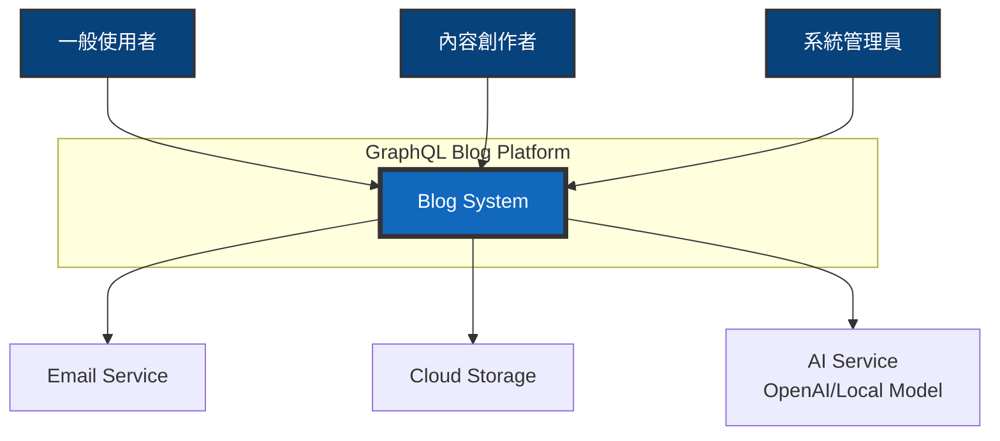
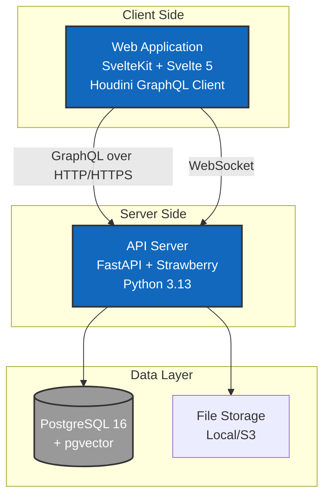
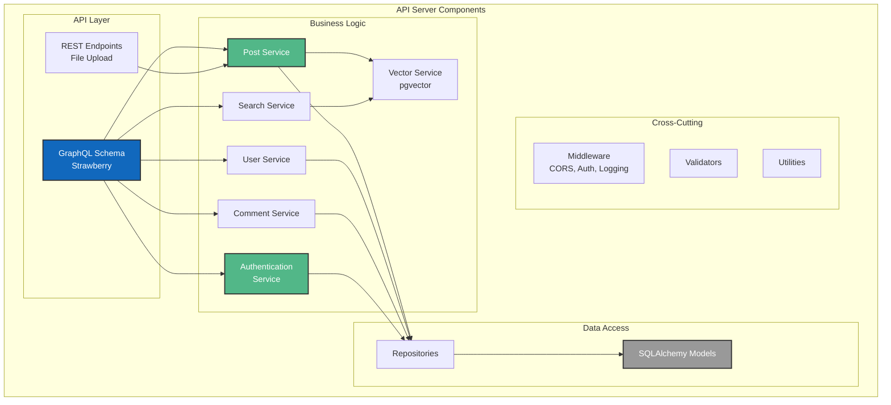
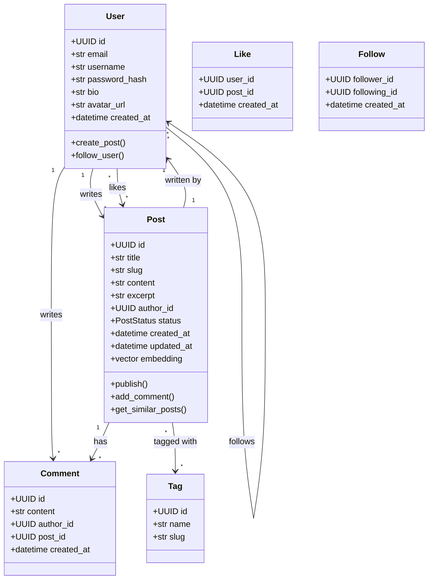
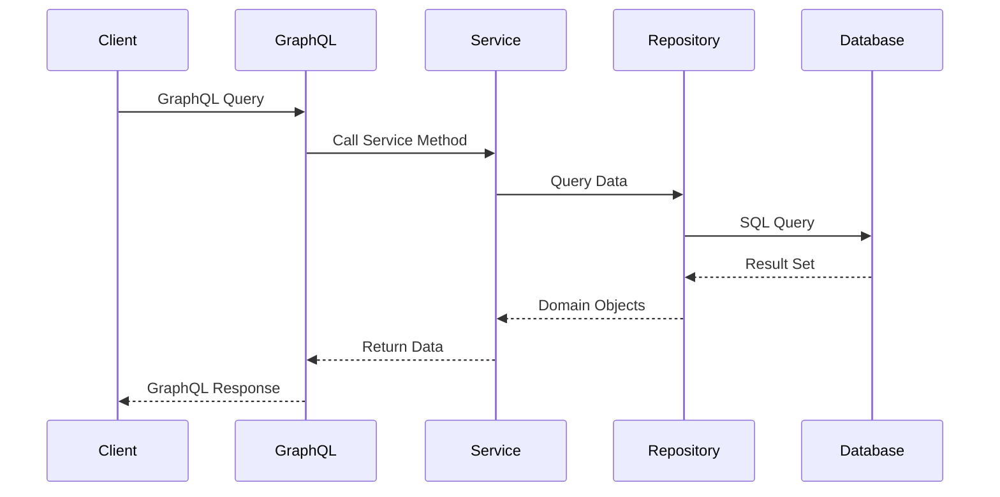
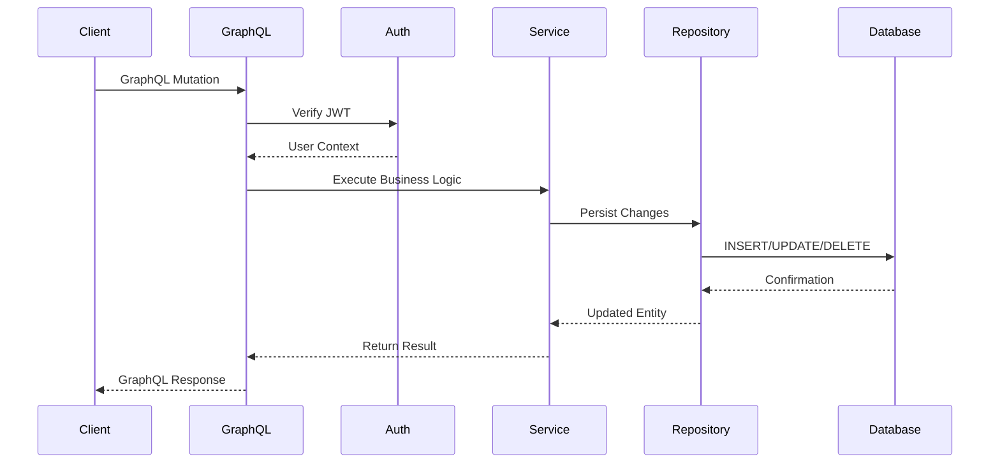
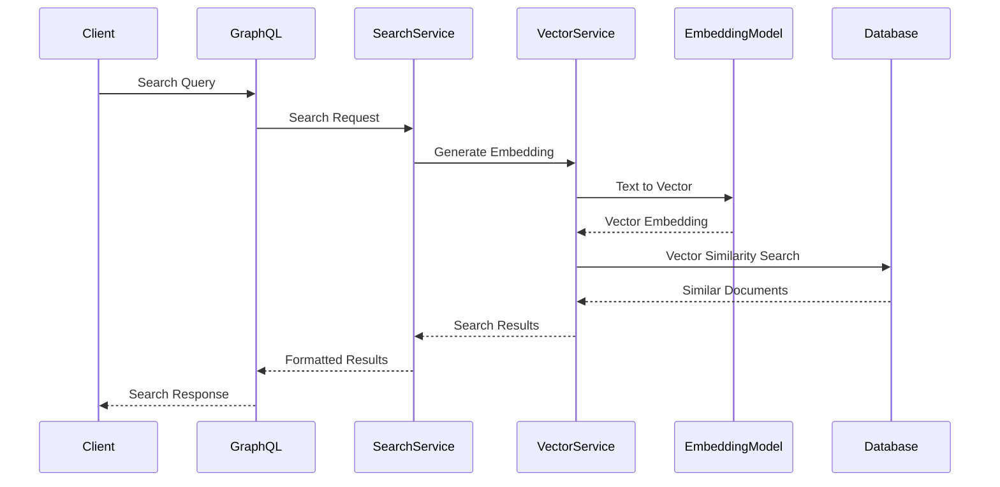
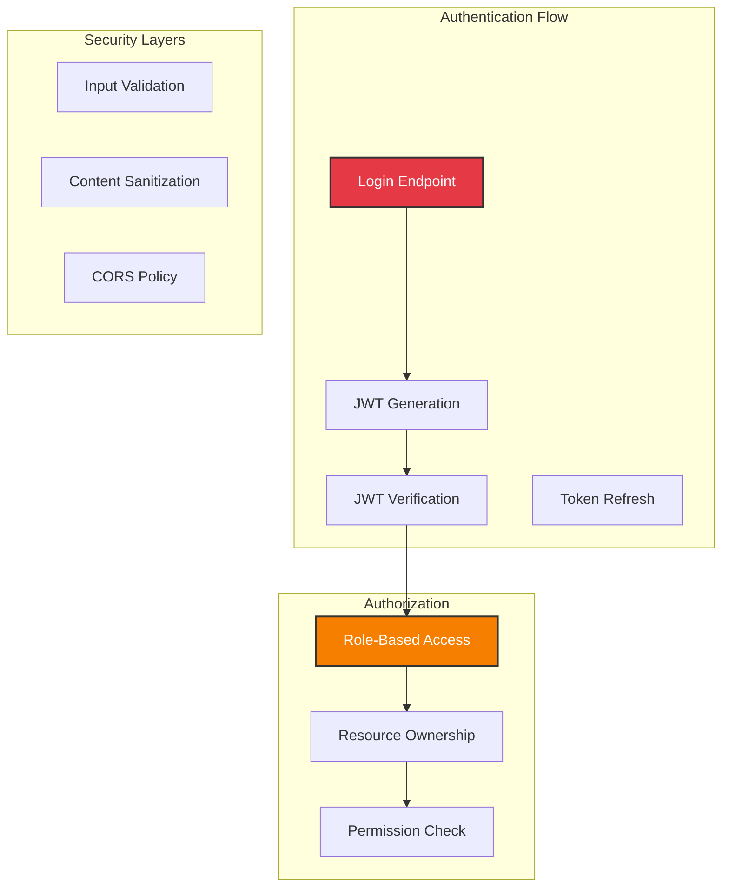
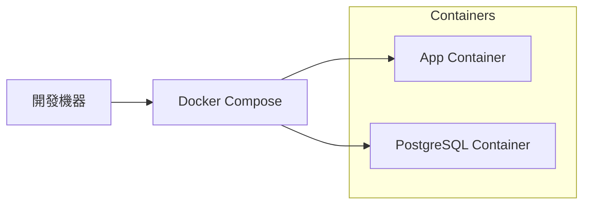

# GraphQL 部落格平台 - 系統架構文件

## 目錄

- [架構概述](#架構概述)
- [C4 模型架構圖](#c4-模型架構圖)
  - [Level 1: System Context](#level-1-system-context)
  - [Level 2: Container Diagram](#level-2-container-diagram)
  - [Level 3: Component Diagram](#level-3-component-diagram)
  - [Level 4: Code Diagram](#level-4-code-diagram)
- [技術決策](#技術決策)
- [資料流程](#資料流程)
- [安全架構](#安全架構)
- [效能考量](#效能考量)

## 架構概述

本系統採用現代化的前後端分離架構，以 GraphQL 作為 API 層，實現高效的資料查詢與變更。後端使用 Python 3.13 搭配 FastAPI 框架，前端使用 SvelteKit 與 Svelte 5，資料庫採用 PostgreSQL 搭配 pgvector 擴充套件支援向量搜尋。

### 技術元件分類

#### 核心元件（必需）
- **PostgreSQL 16** - 主要資料庫
- **FastAPI** - Web 框架
- **Strawberry** - GraphQL 函式庫
- **SQLAlchemy 2.0** - ORM

#### 選用元件（增強功能）
- **pgvector** - 向量搜尋（進階 AI 功能）

### 核心原則

1. **關注點分離**: 清晰的層次架構，各層職責明確
2. **可測試性**: 採用 TDD 開發，確保程式碼品質
3. **可擴展性**: 模組化設計，易於新增功能
4. **效能優先**: 使用異步處理、快取策略、查詢優化

## C4 模型架構圖

### Level 1: System Context

系統整體環境圖，展示系統與外部使用者及系統的互動關係。



### Level 2: Container Diagram

容器層級圖，展示主要的技術組件及其互動方式。



### Level 3: Component Diagram

組件層級圖，展示後端 API Server 的內部結構。



### Level 4: Code Diagram

核心類別圖，展示主要的資料模型與其關係。



## 技術決策

### 為什麼選擇 GraphQL？

1. **精確的資料獲取**: 客戶端可以準確指定需要的資料
2. **減少請求次數**: 一次請求獲取多個資源
3. **強型別**: Schema 提供清晰的 API 契約
4. **自文件化**: Schema 即文件

### 為什麼選擇 FastAPI + Strawberry？

1. **現代 Python**: 充分利用 Type Hints
2. **異步支援**: 原生異步處理提升效能
3. **自動文件**: 自動生成 API 文件
4. **開發體驗**: 優秀的開發者體驗

### 為什麼選擇 PostgreSQL + pgvector？

1. **關聯式資料**: 部落格資料本質上是關聯式的
2. **ACID 特性**: 確保資料一致性
3. **向量搜尋**: pgvector 支援語義搜尋
4. **成熟穩定**: PostgreSQL 是最可靠的開源資料庫

### 為什麼選擇 SvelteKit + Svelte 5？

1. **編譯時優化**: 無虛擬 DOM，效能更好
2. **簡潔語法**: 更少的樣板代碼
3. **Runes 系統**: Svelte 5 的響應式更強大
4. **內建功能**: 路由、SSR 等功能內建

## 資料流程

### 查詢流程 (Query)



### 變更流程 (Mutation)



### 向量搜尋流程



## 安全架構

### 認證與授權



### 安全措施

1. **JWT Token 管理**
   - Access Token: 15 分鐘過期
   - Refresh Token: 7 天過期
   - Token 黑名單機制

2. **輸入驗證**
   - GraphQL Schema 層級驗證
   - Service 層業務邏輯驗證
   - SQL Injection 防護 (ORM)

3. **內容安全**
   - XSS 防護：HTML 消毒
   - CSRF 防護：Token 驗證
   - File Upload：類型與大小限制

4. **存取控制**
   - CORS 設定：限制來源
   - HTTPS：建議使用（教學環境可選）

## 效能考量

### 查詢優化策略

1. **DataLoader Pattern**
   - 解決 N+1 查詢問題
   - 批次載入關聯資料

2. **資料庫索引**
   ```sql
   -- 常用查詢索引
   CREATE INDEX idx_posts_author_id ON posts(author_id);
   CREATE INDEX idx_posts_created_at ON posts(created_at DESC);
   CREATE INDEX idx_posts_status ON posts(status) WHERE status = 'published';

   -- 全文搜尋索引
   CREATE INDEX idx_posts_search ON posts USING gin(to_tsvector('english', title || ' ' || content));

   -- 向量搜尋索引
   CREATE INDEX idx_posts_embedding ON posts USING ivfflat (embedding vector_cosine_ops);
   ```

3. **快取策略**
   - GraphQL 查詢結果快取（可選）
   - CDN 靜態資源快取

### 異步處理

1. **異步 I/O**
   - FastAPI 異步端點
   - SQLAlchemy 異步 Session

2. **異步操作**
   - 向量生成（使用異步函式）
   - 圖片處理（使用異步函式）

### 監控指標

1. **應用程式指標**
   - API 回應時間
   - 錯誤率
   - 請求量

2. **資料庫指標**
   - 查詢效能
   - 連線池使用率
   - 慢查詢日誌

3. **系統指標**
   - CPU 使用率
   - 記憶體使用率
   - 磁碟 I/O

## 部署架構

### 開發環境




## 擴展性設計

### 水平擴展

1. **無狀態設計**: API Server 無狀態，可水平擴展
2. **資料庫讀寫分離**: Master-Replica 架構

### 垂直擴展

1. **資料庫優化**: 查詢優化、索引調整
2. **連線池管理**: 優化連線池大小
3. **資源調配**: 根據負載調整資源

### 微服務預留

雖然初期是單體架構，但設計上預留了拆分可能：

1. **Service 層抽象**: 易於抽取為獨立服務
2. **訊息佇列預留**: 可加入 RabbitMQ/Kafka
3. **API Gateway 預留**: 可加入 Kong/Traefik

## 技術債管理

### 已識別的技術債

1. **初期簡化**
   - 未實作完整的快取失效策略
   - 簡化的錯誤處理
   - 基礎的日誌記錄

2. **待優化項目**
   - 查詢複雜度限制
   - 更細緻的權限控制
   - 完整的審計日誌

### 償還策略

1. **持續重構**: 每個 Sprint 20% 時間
2. **測試覆蓋**: 逐步提高測試覆蓋率
3. **文件更新**: 保持架構文件同步

---

本文件將隨著專案演進持續更新，確保架構決策的透明度與可追溯性。