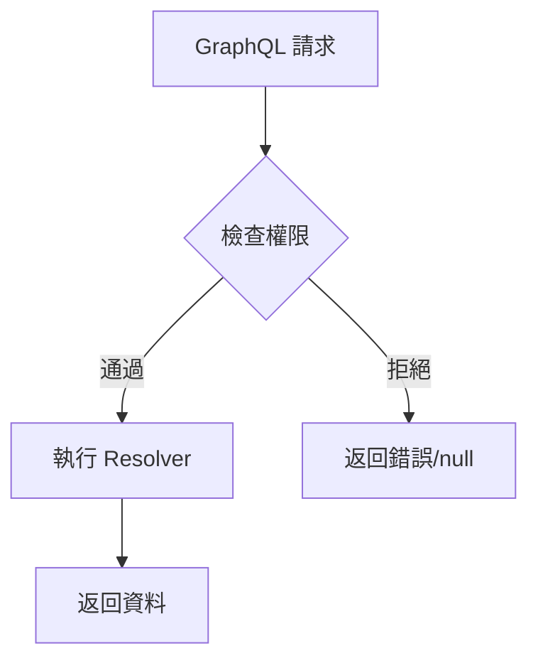

# GraphQL 權限控制指南 (Strawberry Framework)

## 📚 目錄

1. [什麼是權限控制？](#什麼是權限控制)
2. [GraphQL vs REST 權限差異](#graphql-vs-rest-權限差異)
3. [為什麼需要 Field-Level 權限？](#為什麼需要-field-level-權限)
4. [權限類別說明](#權限類別說明)
5. [實作架構](#實作架構)
6. [最佳實踐](#最佳實踐)
7. [常見問題](#常見問題)

---

## 什麼是權限控制？

權限控制是確保只有授權用戶能存取特定資源或執行特定操作的機制。

**權限控制並非 GraphQL 獨有**，Django、FastAPI、Express.js 等框架都有完整的權限系統。

### 權限控制的層級

- **Schema 層級**：整個 API 的存取控制
- **Type 層級**：特定類型的存取控制
- **Field 層級**：特定欄位的精細控制（**GraphQL 最大特色**）
- **Resolver 層級**：業務邏輯中的權限檢查

## GraphQL vs REST 權限差異

### 核心差異對比

| 特性 | REST API | GraphQL |
|------|----------|---------|
| **權限層級** | View/Endpoint 層級 | Field 層級（更細粒度） |
| **控制粒度** | 整個端點的權限 | 單一欄位的權限 |
| **實作位置** | Controller/View | Type/Field 定義 |
| **權限檢查** | 每個端點獨立檢查 | 單一端點，多層檢查 |
| **靈活性** | 需要多個端點實現不同權限 | 單一查詢動態權限 |

### 實際案例說明

**REST 的做法**：需要建立多個端點
- `GET /api/users/public/123` → 公開資料（無需權限）
- `GET /api/users/private/123` → 私人資料（需要權限）
- `GET /api/users/admin/123` → 管理資料（需要管理員權限）

**GraphQL 的做法**：單一端點，動態權限
```graphql
query {
  user(id: "123") {
    username    # 公開：所有人可見
    email       # 私密：只有本人或管理員可見
    phone       # 極私密：只有本人可見
  }
}
```
同一個查詢，不同用戶看到不同資料！

## 為什麼需要 Field-Level 權限？

### 1. 細粒度控制
不同欄位有不同的敏感度，需要不同的權限控制。

### 2. 符合隱私法規
- **GDPR**：個人資料保護
- **CCPA**：消費者隱私權
- **最小權限原則**：只提供必要的資料存取

### 3. 防止資料洩漏
避免在公開查詢中意外暴露敏感資訊。

### 4. 提升 API 效率
單一端點滿足多種權限需求，減少 API 複雜度。

## 權限類別說明

### 基本權限類別

| 權限類別 | 用途 | 使用場景 |
|---------|------|---------|
| `IsAuthenticated` | 要求登入 | 個人資料、創建內容 |
| `IsOwner` | 資源擁有者 | 編輯、刪除自己的內容 |
| `IsSuperuser` | 超級用戶 | 管理功能、敏感資料 |
| `IsOwnerOrSuperuser` | 擁有者或管理員 | 私密欄位如 email |
| `IsOwnerOrReadOnly` | 擁有者可寫，其他人只讀 | 公開內容的編輯 |

### 權限組合邏輯

- **AND 邏輯**：多個權限類別必須同時滿足
  - 例：`[IsAuthenticated, IsOwner]` = 必須登入且是擁有者

- **OR 邏輯**：創建組合權限類別
  - 例：`IsOwnerOrAdmin` = 擁有者或管理員皆可

## 實作架構

### Strawberry 權限系統流程



### Strawberry PermissionExtension 實作

在 Strawberry 中，我們使用 `PermissionExtension` 而非 `@auth` directive 來實現權限控制：

```python
# backend/app/graphql/permissions.py
from strawberry.permission import BasePermission

class IsOwnerOrSuperuser(BasePermission):
    """擁有者或超級用戶可以存取"""
    message = "You don't have permission to view this field"

    async def has_permission(self, source, info, **kwargs) -> bool:
        user = await get_current_user(info)
        if user is None:
            return False

        # 超級用戶允許存取
        if user.is_superuser:
            return True

        # 檢查是否為資源擁有者
        if hasattr(source, 'id'):
            source_id = int(source.id)
            if source_id == user.id:
                return True

        return False
```

### Field-Level 權限應用

```python
# backend/app/graphql/types/user.py
import strawberry
from strawberry.extensions import PermissionExtension

@strawberry.type
class UserType:
    id: strawberry.ID
    username: str

    # 使用 PermissionExtension 保護敏感欄位
    email: Optional[str] = strawberry.field(
        extensions=[
            PermissionExtension(
                permissions=[IsOwnerOrSuperuser()],
                fail_silently=True  # 無權限時返回 null 而非錯誤
            )
        ]
    )
```

### 權限應用範例

**Query 權限**
- `me` → 需要認證
- `users` → 需要超級用戶權限
- `posts` → 公開查詢

**Mutation 權限**
- `createPost` → 需要認證
- `updatePost` → 需要認證且是擁有者
- `deletePost` → 需要認證且是擁有者

**Field 權限**
- `UserType.email` → 只有擁有者或超級用戶能看（已實作）
- `UserType.is_superuser` → 所有認證用戶都能看到（公開欄位）

## 最佳實踐

### 1. 權限分層設計

建立清晰的權限層次：
- **基礎層**：IsAuthenticated（要求登入）
- **角色層**：IsSuperuser、IsModerator
- **資源層**：IsOwner、IsCollaborator

### 2. 錯誤訊息設計

提供清晰但不洩漏敏感資訊的錯誤訊息：
- ✅ "Authentication required"
- ✅ "Permission denied"
- ❌ "User ID 123 is not the owner of Post ID 456"

### 3. 效能考量

- 使用 DataLoader 批次載入權限檢查所需資料
- 快取權限檢查結果避免重複查詢
- 在適當層級進行權限檢查，避免過度檢查

### 4. 安全原則

- **預設拒絕**：沒有明確授權就拒絕存取
- **最小權限**：只給予必要的權限
- **深度防禦**：多層權限檢查

## 常見問題

### Q1: GraphQL 權限與 Django/REST 權限有什麼不同？

**概念相似，實作層級不同**：
- **REST**：通常在 View/Endpoint 層級控制
- **GraphQL**：可以細到 Field 層級控制
- **共同點**：都支援 IsAuthenticated、IsOwner 等概念

### Q2: 權限檢查會影響效能嗎？

**合理設計不會有明顯影響**：
1. 權限檢查在 Resolver 執行前進行
2. 使用 DataLoader 避免 N+1 查詢
3. 適當的快取策略可以提升效能

### Q3: 如何處理部分欄位無權限的情況？

**Strawberry 提供兩種策略**：

1. **拋出錯誤**（`fail_silently=False`）：明確告知用戶無權限
   ```python
   email: str = strawberry.field(
       extensions=[PermissionExtension(permissions=[IsOwner()])]
   )  # 無權限時拋出錯誤
   ```

2. **返回 null**（`fail_silently=True`）：靜默處理，適用於選擇性欄位
   ```python
   email: Optional[str] = strawberry.field(
       extensions=[PermissionExtension(
           permissions=[IsOwnerOrSuperuser()],
           fail_silently=True
       )]
   )  # 無權限時返回 null
   ```

### Q4: 權限與訂閱（Subscription）如何配合？

**訂閱也支援權限控制**：
- 建立訂閱時檢查權限
- 推送更新時再次驗證權限
- 可以根據權限過濾推送內容

### Q5: 如何測試權限控制？

**完整的測試策略**：
1. 單元測試每個權限類別
2. 整合測試不同角色的存取場景
3. 端到端測試完整的使用流程

## 總結

### GraphQL 權限的核心優勢

**細粒度控制**：Field-level 權限精確控制資料存取

**單一端點**：不需要為不同權限建立多個端點

**動態返回**：同一查詢根據權限返回不同資料

**概念通用**：與其他框架的權限概念相通

### Strawberry 實作特色

1. **PermissionExtension**：優雅的權限裝飾器模式
2. **fail_silently 選項**：彈性的錯誤處理策略
3. **BasePermission 繼承**：易於擴展的權限類別設計
4. **異步支援**：原生支援 async/await 權限檢查

### 重要提醒

1. **權限控制不是 GraphQL 獨有**，但 Field-level 控制是其特色
2. **概念與 Django/REST 相似**，實作層級不同
3. **正確實施權限控制**是保護 API 安全的關鍵
4. **Strawberry 使用 PermissionExtension 而非 @auth directive**

## 相關資源

- [GraphQL 官方文檔 - Authorization](https://graphql.org/learn/authorization/)
- [Strawberry GraphQL - Permissions](https://strawberry.rocks/docs/guides/permissions)
- [Strawberry PermissionExtension](https://strawberry.rocks/docs/extensions/permission-extension)
- [本專案權限實作](../backend/app/graphql/permissions.py)
- [權限測試範例](../backend/tests/graphql/test_auth_directive.py)
- [架構設計文檔](./architecture.md#graphql-安全特性)